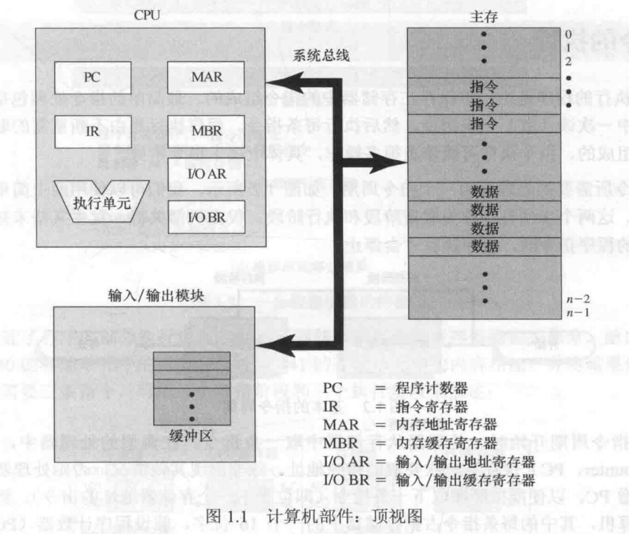
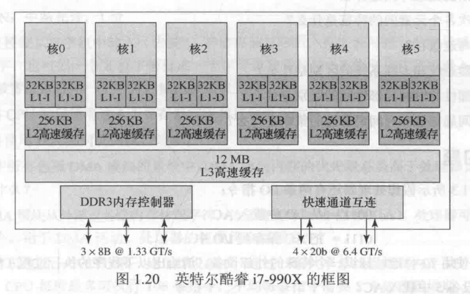

# 操作系统精髓与设计原理(第8版) - 第一章 计算机系统概述

## 1.1 基本构成

计算机由处理器、存储器和输入/输出部件组成，每类部件都有一个或多个模块。主要是4个结构化部件：

**处理器**：控制计算机的操作，执行数据处理功能。

**内存**：存储数据和程序。

**输入/输出模块**：在计算机和外部环境之间移动数据。

**系统总线**：在处理器、内存和输入/输出模块间提供通信的设施。

处理器的一种功能是与存储器交换数据。为此，它通常使用两个内部寄存器：存储器地址寄存器，用于确定下一次读/写的存储器地址；存储器缓冲寄存器，存放要写入存储器的数据或从存储器中读取的数据。输入/输出地址寄存器，用于确定一个特定的输入/输出设备，输入/输出缓冲区寄存器用于在输入/输出模块和处理器间交换数据。

内存模块有一组单元组成，这些单元由顺序编号的地址定义。每个单元包含一个二进制数据，它可解释为一个指令或数据。输入/输出模块在外部设备与处理器之间传输数据。输入/输出模块包含内存缓冲区，用于临时保存数据，直到它们被发送出去。

## 1.2 微处理器的发展

## 1.3 指令的执行

## 1.8 多处理器和多核计算机组织结构

三种通过复制处理器来提供并行处理性的手段：堆成处理器（SMP）、多核计算机和集群。

### 1.8.1 对称对处理器

### 1.8.2 多核处理器

多核计算机是指将两个或多个处理器组装在同一块硅上的计算机，故又名芯片多处理器。每个核上通常会包含组成一个独立处理器的所有零部件，如寄存器、ALU、流水线硬件、控制单元，以及L1指令和数据高速缓存。

