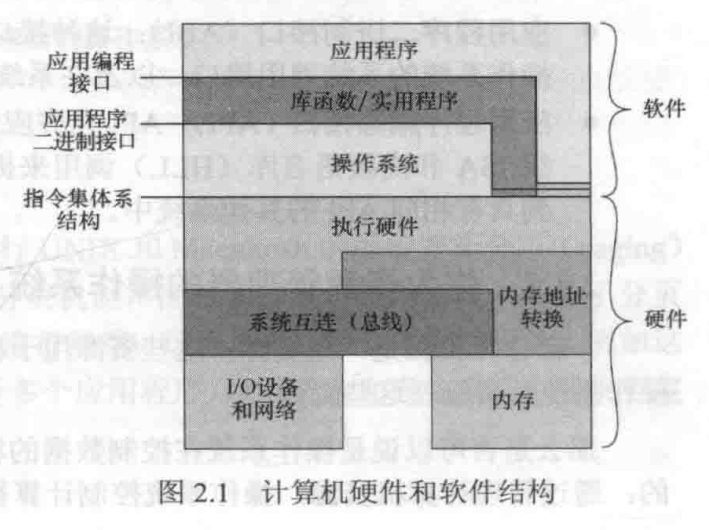
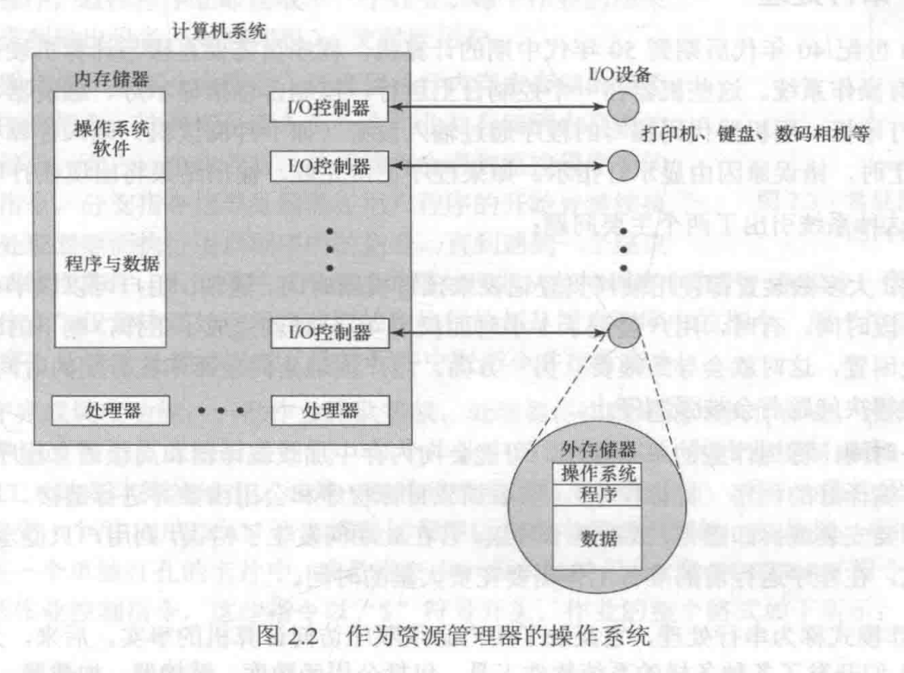
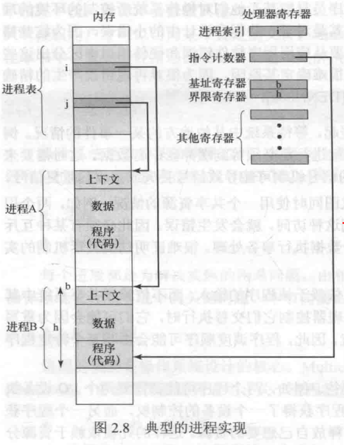
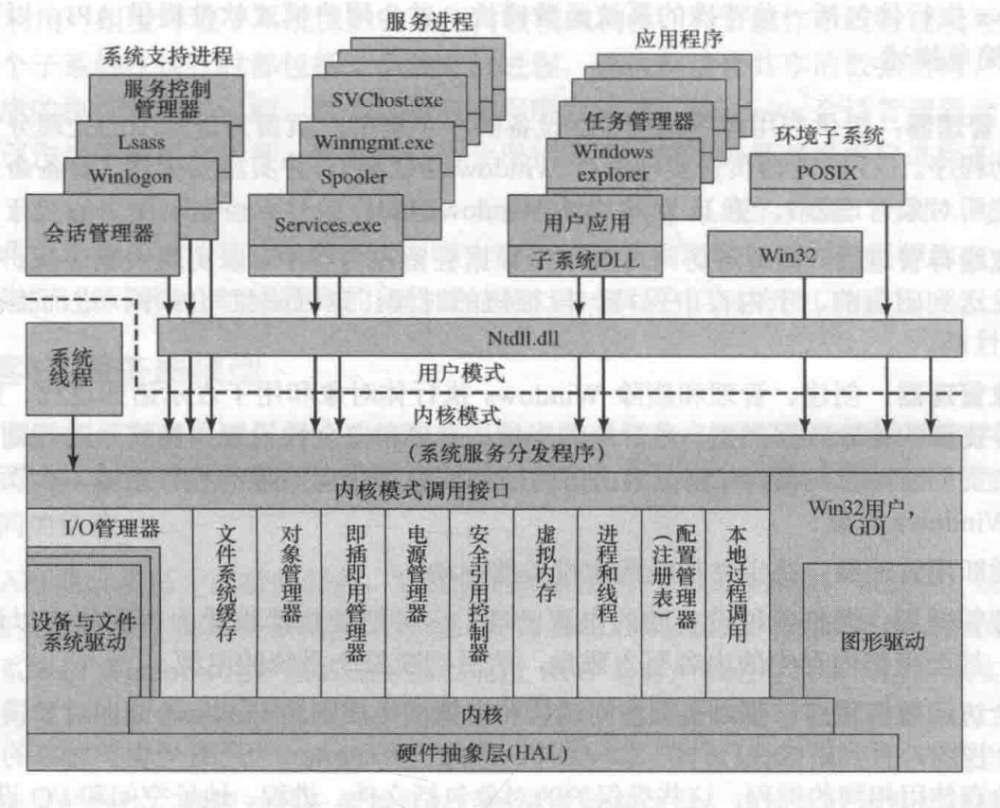
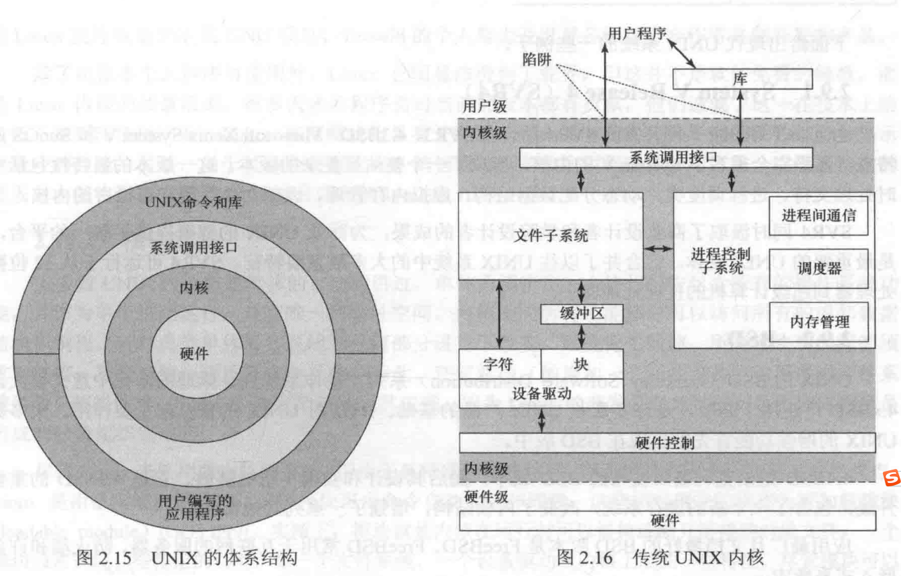
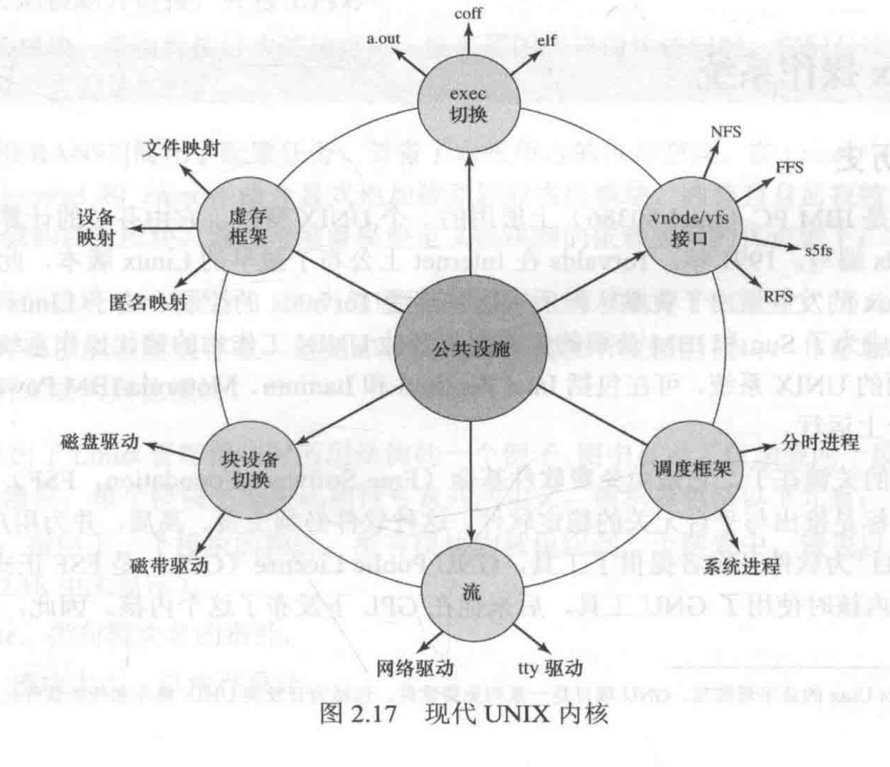

# 操作系统精髓与设计原理(第8版) - 第二章 操作系统概述

## 2.1 操作系统的目标与功能

 		操作系统是控制应用程序执行的程序，是应用程序和计算机硬件间的接口。它有三个目标：

- **方便**：操作系统使计算机更易于使用。
- **有效**：操作系统允许以更有效的方式使用计算机系统资源。
- **扩展能力**：在构造操作系统时，应允许在不妨碍服务的前提下，有效地开发、测试和引入新的系统功能。

### 2.1.1 作为用户/计算机接口的操作系统

 	   应用程序的用户，即终端用户，把计算机系统视为一组应用程序。为了简化开发任务，系统需要提供一些实用程序或库，实现创建程序、管理文件和控制IO设备时经常使用的功能。

 		操作系统通常提供以下几个方面的服务：

- **程序开发**：操作系统提供用于开发的各种各样的工具和服务，称为应用程序开发工具。
- **程序运行**：把指令和数据加载到内存、初始化IO设备和文件、准备其他一些资源。操作系统为用户处理这些调度问题。
- **IO设备访问**：操作系统隐藏不同IO设备操作的差异，并提供统一的接口。
- **文件访问控制**：操作系统必须了解IO设备的特性，必须详细了解存储介质中文件数据的结构，提供保护机制来控制对文件的访问。
- **系统访问**：提供对资源和数据的保护，避免未授权用户的访问，还必须解决资源竞争时的冲突。
- **错误检测和响应**：操作系统必须提供对运行时可能发生各种各样错误的响应以清除错误条件，使其对正在运行的应用程序影响最小。
- **记账**：操作系统可以收集对各种资源的利用率的统计数据，监控诸如响应时间之类的性能参数。

- 典型计算机系统有三种重要的接口：
	 		**指令系统体系结构（ISA）**：定义了计算机遵循的机器语言指令系统，该接口是硬件与软件的分界线。
- **应用程序二进制接口（ABI）**：定义了程序间二进制可移植性的标准。
- **应用程序编程接口（API）**：允许应用程序访问系统的硬件资源和服务。

### 2.1.2 作为资源管理器的操作系统

 		操作系统控制处理器使用其他系统资源，并控制其他程序的执行机制。处理器要做任何一件这类事情时，都必须听孩子执行操作系统程序，而去执行其他程序。这时操作系统会释放对处理器的控制，让处理器去做其他一些有用的工作，然后用足够长的时间恢复控制权，让处理器准备好做下一件工作。

 		操作系统的一部分在内存中，包括内核程序和当前长在使用的其他操作系统程序，内核程序包含操作系统中最常使用的功能。内存的其余部分包含用户程序和数据，它的分配由操作系统和处理器中的存储管理区硬件联合控制完成。操作系统决定在程序运行过程中何时使用IO设备，并控制文件的访问和使用。决定在运行一个特定的用户程序时，可以分配多少处理器时间。

### 2.1.3 操作系统的易扩展性

 		操作系统应能不断发展，原因如下：

- 硬件升级和新型硬件的出现

- 新的服务

- 纠正错误

## 2.2 操作系统的发展史

- 串行处理：20世纪40年代后期到50年代中期
- 简单批处理系统：20世纪50年代中期由General Motors开发
- 多道批处理系统
- 分时系统

## 2.3 主要成就

### 2.3.1 进程

进程的定义：

- 一个正在执行的程序
- 计算机中正在运行的程序的一个实体
- 可分配给处理器并由处理器执行的一个实体
- 有一个单一顺序线程、一个当前状态和一组相关的系统资源所表征的活动单元

要解决的问题：

- 不正确的同步
- 失败的互斥
- 不确定的程序操作
- 死锁

进程由三部分组成：

- 一段可执行的程序
- 程序所需要的相关数据（变量、工作空间、缓冲区等）
- 程序的执行上下文

 		执行上下文又称为进程状态，是操作系统用来管理和控制进程所需的内部数据。上下文包括操作系统管理进程及处理器正确执行进程所需的所有信息，包括各种处理器寄存器的内容，包括进程优先级及进程是否在等待特定IO事件的完成。

 		每个进程分配了一块存储区域，并且在操作系统建立和维护的进程表中进行了记录。进程表包含记录每个进程的表项，表项的内容包括指向包含进程的存储块地址的指针，还包括该进程的部分或全部执行上下文。

 		**进程索引寄存器**包含当前正在控制处理器的进程在进程表中的索引。**程序计数器**指向该进程中下一条待执行的指令。**基址寄存器**和**界限寄存器**定义该进程所占据的存储器区域，基址寄存器中保存在存储器区域的开始地址，界限寄存器中保存该区域的大小（以字节或字为单位）。

### 2.3.2 内存管理

 		操作系统担负着5项存储器管理的职责：

- 进程隔离
- 自动分配和管理
- 支持模块化程序设计
- 保护和访问控制
- 长期存储

 		虚存机制允许程序以逻辑方式访问存储器，而不考虑物理内存上可用的空间数量。在分页系统中，进程有许多固定大小的块组成，这些块称为页。程序通过虚地址访问字，虚地址由页号和页中的偏移量组成。分页系统提供了程序中使用的虚地址和内存中的实地址或物理地址之间的动态映射。若访问的某页不在内存中，存储器管理硬件会在检测到它后，安排载入这个缺页。

 		给每个进程唯一的不重叠虚存空间，可以实现进程隔离；使两个虚存空间的一部分重叠，可实现内存共享；文件可用于长期存储，文件或其一部分可以复制到虚存中供程序操作。

### 2.3.3 信息保护和安全

- **可用性**：保护系统不被中断
- **保密性**：保证用户不能读取未访问的数据
- **数据完整性**：保护数据不被未授权修改
- **认证**：涉及用户身份的正确认证和消息或数据的合法性

### 2.3.4 调度和资源管理

 		操作系统的一个关键任务是管理各种可用资源（内存空间、IO设备、处理器），并调度各种活动进程来使用这些资源。要考虑3个因素：

- **公平性**
- **有差别的响应性**
- **有效性**

## 2.4 现代操作系统的特征

- 微内核体系结构
- 多线程
- 对称多处理
- 分布式操作系统
- 面向对象设计

## 2.5 容错性

### 2.5.1 基本概念

 		容错性是指系统或部件在发生软硬件错误时，能够继续正常运行的能力。

### 2.5.2 错误

错误一般分为以下几类：

- 永久性错误
- 临时性错误
  - 瞬时性错误
  - 间歇性错误

系统容错性是通过增加冗余余度实现的：

- 空间（物理）冗余
- 时间冗余
- 信息冗余

### 2.5.3 操作系统机制

- 操作系统软件中采用了许多技术来提高容错性
- 进程隔离
- 并发控制
- 虚拟机
- 检测点和回滚机制

## 2.6 多处理器和多核操作系统设计考虑因素

### 2.6.1 对称多处理器操作系统设计考虑因素

- 并发进程或线程
- 调度
- 同步
- 内存管理
- 可靠性和容错性

### 2.6.2 多核操作系统设计考虑因素

- 应用层并行
- 虚拟机方式

## 2.7 微软Windows系统简介

 		windows分开了面向应用的软件和操作系统核心软件，后者包括在内核模式下运行的执行体、内核、设备驱动、和硬件抽象层。在内核模式下运行的软件可以访问系统数据和硬件，在用户模式下运行的其他软件则不能访问系统数据。

 		每个系统函数都正好有一个操作系统部件管理，操作系统的其他部分和所有应用程序通过相应的部件使用标准接口来访问这个函数。关键的系统函数只能通过相应的函数访问。

Windows的内核模式组件包括以下几个类型：

- 执行体
- 内核
- 硬件抽象层
- 设备驱动
- 窗口和图形系统

windows执行体包括一些特殊的系统函数模块：

- IO管理器
- 高速缓存管理器
- 对象管理器
- 即插即用管理器
- 电源管理器
- 安全访问监控程序
- 虚存管理器
- 配置管理器
- 本地调用过程

用户模式进程：

- 特殊系统进程
- 服务进程
- 环境子系统
- 用户应用程序

## 2.8 传统的Unix系统

## 2.9现代Unix系统

- System V Release 4（SVR4）
- BSD
- Solaris 10

## 2.10 Linux操作系统

 		Linux高度模块化且易于配置，因此很容易在各种不同的硬件平台上显示出最佳的性能。

 		尽管Linux未采用微内核的方法，单由于其特殊的模块结构，因而也具有很多为内核方法的优点。Linux是由很多模块组成的，这些模块可由命令自动加载和卸载。这些相对应的块称为**可加载模块**。实质上，模块就是内核在运行时可以链接或断开链接的对象文件。模块可以因为各种目的而创建内核线程，但其自身不作为进程或线程执行。当然模块会代表当前进程在内核模式下执行。

 		Linux可加载模块有两个重要特征：

- **动态链接**：当内核已在内存中并正在运行时，内核模块可被加载和连接到内核。模块也可在任何时刻被断开连接，并移出内存。
- **可堆叠模块**：模块可按层次结构排列。被高层的客户模块访问时，它们是库，被底层的模块访问时，它们是客户。

 		在Linux中，用户程序或用户可以使用insmod和rmmod命令显示地加载和卸载内核模块，内核自身监视特定函数的需求，并根据需求加载和卸载模块。可堆叠模块定义的优点如下：

1. 多个类似模块的相同代码可移入单个模块中，因此降低了重复性。
2. 内核可确保所需模块存在，避免卸载其它正在运行模块所依赖的模块，并在加载新模块时一同加载所需要的其他模块。

 		主要内核组件的简要介绍如下：

- **信号**：内核使用信号来向进程提供信息
- **系统调用**：进程通过系统调用来请求系统服务。系统调用大致分为6类：文件系统、进程、调度、进程间通信、套节奏（网络）和其他。
- **进程和调度器**：创建、管理、调度进程。
- **虚存**：为进程分配和管理虚存。
- **文件系统**：为文件、目录和其他文件相关对象提供一个全局的分层命名空间，并提供文件系统函数。
- **网络协议**：为用户的TCP/IP协议套件提供套接字接口。
- **字符设备驱动**：管理向内核一次发送/接收1字节数据的设备。
- **块设备驱动**：管理以块为单位向内核发送/接收数据的设备，如各种形式的外存（磁盘、CD-ROM等）。
- **网络设备驱动**：管理网卡和通信端口，即管理连接到网桥或路由的网络设备。
- **陷阱和错误**：处理CPU产生的陷阱和错误，如内存错误。
- **物理内存**：管理实际内存中的内存页池，并为虚存分配内存页。
- **中断**：处理来自外设的中断。

## 2.11 Android

 		Android是一个包括操作系统内核、中间件、关键应用的软件栈。

- **应用**：与用户直接进行交互的所有应用都是应用层的一部分。

- **应用框架**：应用框架层提供高级构建块，为程序员开发程序提供标准化的访问接口，旨在简化组件的复用。
  - **活动管理器**：管理应用的生命周期，即负责启动、停止和恢复各个应用。
  - **窗口管理器**：底层界面管理器的抽象，界面管理其处理帧缓冲区的交互和底层的绘制，而窗口管理器在其上提供了新的一层，允许应用声明客户端区域并使用类似状态栏的特性。
  - **包管理器**：安装和删除应用。
  - **电话管理器**：允许与电话、短信和彩信服务交互。
  - **内容接口**：这些函数将封装应用间需要共享的应用数据，如联系人数据。
  - **资源管理器**：管理应用程序的资源，如本地化字符串和位图。
  - **视图系统**：提供用户界面（UI）元素，如按钮、列表框、日期选择器和其他控件，以及UI事件（如触摸和手势）。
  - **位置管理器**：允许开发人员使用基于位置的服务，可以基于全球定位系统（GPS）、基站ID或本地WIFI数据库等。
  - **通知管理器**：触发规定事件时提醒用户，如收到信息、到达约会时间。
  - **XMPP**：管理应用层间的通信。
- 系统库：应用层下面一层由两部分组成：系统库和运行库。系统库组件是用C或C++编写的实用系统函数集，可被Android系统的各个组件使用。应用可通过Java接口来对其进行调用，同时这些功能向开发者开放。
  - **界面管理器**：Android使用了类似于Vista、Compiz的排版窗口管理器，但与后者相比要简单得多。它不直接写入绘图缓冲区，而是根据绘图命令构建离屏位图文件，然后在合并其他位图文件后，一同展示给用户，因此系统可创建各种有趣的效果，如透明窗口和华丽切换。
  - **OpenGL**：OpenGL（Open Graphics Library）是一种跨语言、跨平台的应用接口，用于-

**报警功能**是在Linux内核中实现的，开发者可通过调用运行库中的报警管理器来操作。通过告警管理器，应用可以请求定时叫醒服务。报警管理器是内核服务，目的是让应用即使在系统休眠的情况下也能触发警告提醒。这就使得系统随时可以进入休眠状态以节省电能。

**唤醒锁**可以阻止Android系统进入休眠模式。一个应用程序占有以下唤醒锁中的一个：

- **full_wake_lock**：处理器工作，屏幕亮，键盘亮。
- **partial_wake_lock**：处理器工作，屏幕关，键盘关。
- **screen_dim_wake_lock**：处理器工作，屏幕暗，键盘关。
- **screen_bright_wake_lock**：处理器工作，屏幕亮，键盘关。

 		当应用要求被管理的外设保持供电时，会通过API请求对应的锁。若无唤醒锁存在，系统就会锁定并关闭设备以节省电能。

 		通过访问/sys/power/wavelock文件，用户可在用户空间中访问内核中的电源管理的相应对象。把wake_lock和wake_unlock文件写入响应的文件，用户可以定义和切换锁。

## 2.13 关键术语、复习题和习题

### 2.13.2 复习题

**2.1 操作系统设计的三个目标是什么？**

- **方便**：操作系统使计算机更易于使用。
- **有效**：操作系统允许以更有效的方式使用计算机系统资源。
- **扩展能力**：在构造操作系统时，应允许在不妨碍服务的前提下，有效地开发、测试和引入新的系统功能。

**2.2 什么是操作系统的内核？**

​		内核是操作系统最常使用的部分，它存在于主存中并在特权模式下运行，响应进程调度和设备中断。

**2.3 什么是多道程序设计？**

 		多道程序设计是一种处理操作，它在两个或多个程序间交错处理每个进程。

**2.4 什么是进程？**

 		进程是一个正在执行的程序，它被操作系统控制和选择。

**2.5 操作系统时怎样使用进程上下文的？**

 		执行上下文又称为进程状态，是操作系统用来管理和控制所需的内部数据。这种内部信息和进程是分开的，因为操作系统信息不允许被进程直接访问。上下文包括操作系统管理进程以及处理器正确执行进程所需要的所有信息，包括各种处理器寄存器的内容，如程序计数器和数据寄存器。它还包括操作系统使用的信息，如进程优先级以及进程是否在等待特定I/O事件的完成。

**2.6 列出并简要介绍操作系统的5中典型存储管理职责。**

- 进程隔离
- 自动分配和管理
- 支持模块化程序设计
- 保护和访问控制
- 长期存储

P42 **2.3.2 内存管理**

**2.7 实地址和虚地址的区别是什么？**

 		虚地址指的是存在于虚拟内存中的地址，它有时候在磁盘中有时候在主存中。 

 		实地址指的是主存中的地址。

**2.8 描述时间片轮转调度技术。**

 		轮循调度是一种调度算法，所有的进程存放在一个环形队列中并按固定循序依次激活。因为等待一些事件（例如：等待一个子进程或一个I/O操作）的发生而不能被处理的进程将控制权交给调度器。

**2.9 解释单体内核和微内核的区别。**

 		单体内核是一个提供操作系统应该提供的功能的大内核，包括调度、文件系统、网络、设备驱动程序、存储管理等。内核的所有功能成分都能够访问它的内部数据结构和程序。典型情况下，这个大内核是作为一个进程实现的，所有元素都共享相同的地址空间。 

 		微内核是一个小的有特权的操作系统内核，只提供包括进程调度、内存管理、和进程间通信等基本功能，要依靠其他进程担当起和操作系统内核联系作用。

**2.10 什么是多线程？**

 		多线程技术是指把执行一个应用程序的进程划分成可以同时运行的多个线程。

**2.11 列出对称多处理操作系统设计时要考虑的关键问题。**

- 并发进程或线程
- 调度
- 同步
- 内存管理
- 可靠性和容错性