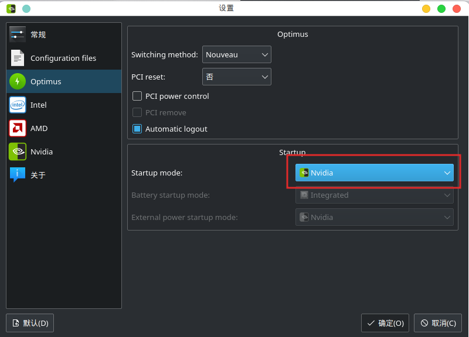

# ArchLinux Gnome 安装英伟达显卡驱动

我的电脑详细配置信息：


## 0. 安装前准备

编辑`pacman.conf`文件启用32位软件源

```bash
sudo vim /etc/pacman.conf
```

将以下两行的注释取消（删除前面的#）

```bash
[multilib]
Include = /etc/pacman.d/mirrorlist
```

添加archlinuxcn源，那么配置方法如下：

在文件末尾添加以下内容

```bash
[archlinuxcn]
Server = https://mirrors.tuna.tsinghua.edu.cn/archlinuxcn/$arch
```

同步软件包数据库

```bash
sudo pacman -Syy
```

安装密匙：

```bash
sudo pacman -S archlinuxcn-keyring
```

更新系统

```bash
sudo pacman -Syyu
```

安装yay
```bash
sudo pacman -S yay
```

安装base-devel

```bash
sudo pacman -S base-devel
```

## 1. 安装显卡驱动

安装intel核显驱动

```bash
sudo pacman -S xf86-video-intel
```

安装Nvidia显卡闭源驱动

```bash
sudo pacman -S nvidia nvidia-prime nvidia-settings nvidia-utils opencl-nvidia lib32-nvidia-utils lib32-opencl-nvidia
```

## 2. 安装显卡切换工具

安装optimus-manager

```bash
yay -S optimus-manager
```

安装图形化切换工具

```bash
yay -S optimus-manager-qt
```

安装gdm-prime*

```bash
yay -S gdm-prime
```

安装nouveau（安装了bbswitch的用户可以不用安装）

```bash
 sudo pacman -S xf86-video-nouveau
```

## 3. 显卡切换工具配置

禁用Gnome Wayland模式

编辑`/etc/gdm/custom.conf`

```bash
sudo vim /etc/gdm/custom.conf
```

删除`#WaylandEnable=false`行前的`#`

取消NVIDIA黑名单

编辑`/lib/modprobe.d/optimus-manager.conf`

```bash
sudo vim /lib/modprobe.d/optimus-manager.conf
```

在所有nvidia行前添加`#`

启动optimus-manager服务

```bash
sudo systemctl enable optimus-manager.service
```

## 4. 修复Nvidia 驱动无法加载

编辑grub配置文件

```bash
sudo vim /etc/default/grub
```

在启动参数添加`ibt=off`

## 5. 显卡切换

安装完成以后控制台直接输入optimus-manager-qt启动，此时系统托盘会出现intel图标。

```bash
optimus-manager-qt
```


在导航栏的Intel图标上点击右键，在列表中选择设置功能，左侧单击optimus，将右侧窗口中switching method选择为Nouveau（安装了bbswitch的用户选择bbswitch即可)。


安装完成以后可以在导航栏的intel图标上右键切换要使用的显卡类型，切换后需要注销并重新登录才会生效。

然后右击导航栏Intel图标就可以选择自己想要使用的显卡类型，我这里选择英伟达显卡后，需要注销并重新登录才会生效。


也可以在终端使用命令切换显卡

```bash
# 切换为英伟达显卡
optimus-manager --switch nvidia
# 切换为intel核显
optimus-manager --switch intel
```

切换后，使用glxinfo命令可以查看当前正在使用的显卡。

```bash
# Intel
[wenjie@wj ~]$ glxinfo | grep "OpenGL renderer"
OpenGL renderer string: Mesa Intel(R) UHD Graphics 630 (CFL GT2)
# 切换NVIDIA显卡后
[wenjie@wj ~]$ glxinfo | grep "OpenGL renderer"
OpenGL renderer string: NVIDIA GeForce GTX 1050 Ti/PCIe/SSE2
```

设置开启启动后默认使用的显卡：这里选择英伟达显卡就行了

