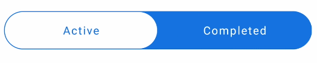
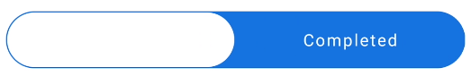
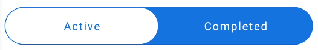

# Jetpack Compose实现滑块式标签tab



## 1. 先完成一个基本的tab


```kotlin
@Composable
fun SliderTabs() {
    var selectedIndex by remember { mutableStateOf(0) }
    val bgColor = Color(0xff1E76DA)

    val list = listOf("Active", "Completed")
    TabRow(
        selectedTabIndex = selectedIndex,
        backgroundColor = bgColor,
        modifier = Modifier.padding(vertical = 4.dp, horizontal = 8.dp),
        indicator = { tabPositions ->
            TabRowDefaults.Indicator(
                modifier = Modifier.tabIndicatorOffset(tabPositions[selectedIndex]),
                color = Color.White
            )
        }
    ) {
        list.forEachIndexed { index, text ->
            val selected = selectedIndex == index
            Tab(
                selected = selected,
                onClick = { selectedIndex = index },
                text = { Text(text = text, color = Color.White) }
            )
        }
    }
}
```

## 2. TabRow改为胶囊样式


```kotlin
Modifier.clip(RoundedCornerShape(50))
```

## 3. 指示器改为胶囊样式



```kotlin
Modifier
    .tabIndicatorOffset(tabPositions[selectedIndex])
    .fillMaxSize()
    .padding(1.dp)
    .clip(RoundedCornerShape(50))
```

## 4. 文字置于上层，并且选中时改变文字颜色

指示器尺寸设置为`fillMaxSize`后遮挡了标签文字，需要将文字置于上层。



```kotlin
Modifier.zIndex(2f)
val textColor = if (selected) bgColor else Color.White
Tab(
    modifier = Modifier.zIndex(2f),
    selected = selected,
    onClick = { selectedIndex = index },
    text = { Text(text = text, color = textColor) }
)
```

## 5. 禁用点击水波纹效果

```kotlin
class NoRippleInteractionSource : MutableInteractionSource {
    override val interactions: Flow<Interaction> = emptyFlow()
    override suspend fun emit(interaction: Interaction) {}
    override fun tryEmit(interaction: Interaction) = true
}

Tab(
    modifier = Modifier.zIndex(2f),
    selected = selected,
    onClick = { selectedIndex = index },
    text = { Text(text = text, color = textColor) },
    interactionSource = NoRippleInteractionSource()
)
```

### 6. 文字颜色添加渐变动画

```kotlin
val textColor = remember {
	Animatable(Color.White)
}
LaunchedEffect(
	selected
) {
	textColor.animateTo(if (selected) bgColor else Color.White)
}
Tab(
    modifier = Modifier.zIndex(2f),
    selected = selected,
    onClick = { selectedIndex = index },
    text = { Text(text = text, color = textColor.value) },
    interactionSource = NoRippleInteractionSource()
)
```

## 7. 完整代码

```kotlin
@Composable
fun SliderTabs() {
    var selectedIndex by remember { mutableStateOf(0) }
    val bgColor = Color(0xff1E76DA)

    val list = listOf("Active", "Completed")
    TabRow(
        selectedTabIndex = selectedIndex,
        backgroundColor = Color(0xff1E76DA),
        modifier = Modifier
            .padding(vertical = 4.dp, horizontal = 8.dp)
            .clip(RoundedCornerShape(50)),
        indicator = { tabPositions ->
            TabRowDefaults.Indicator(
                modifier = Modifier
                    .tabIndicatorOffset(tabPositions[selectedIndex])
                    .fillMaxSize()
                    .padding(1.dp)
                    .clip(RoundedCornerShape(50)),
                color = Color.White
            )
        }
    ) {
        list.forEachIndexed { index, text ->
            val selected = selectedIndex == index
            val textColor = remember {
                Animatable(Color.White)
            }
            LaunchedEffect(
                selected
            ) {
                textColor.animateTo(if (selected) bgColor else Color.White)
            }

            Tab(
                modifier = Modifier.zIndex(2f),
                selected = selected,
                onClick = { selectedIndex = index },
                text = { Text(text = text, color = textColor.value) },
                interactionSource = NoRippleInteractionSource()
            )
        }
    }
}
```

