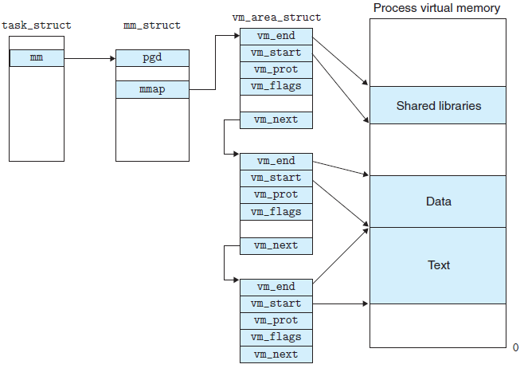

 内存映射信息放在vma参数中，注意，这里的vma的数据类型是struct vm_area_struct，它表示的是一块连续的虚拟地址空间区域，在函数变量声明的地方，我们还看到有一个类似的结构体struct vm_struct，这个数据结构也是表示一块连续的虚拟地址空间区域。

那么，这两者的区别是什么呢？在Linux中，struct vm_area_struct表示的虚拟地址是给进程使用的，而struct vm_struct表示的虚拟地址是给内核使用的，它们对应的物理页面都可以是不连续的。struct vm_area_struct表示的地址空间范围是0~3G，而struct vm_struct表示的地址空间范围是(3G + 896M + 8M) ~ 4G。struct vm_struct表示的地址空间范围为什么不是3G~4G呢？原来，3G ~ (3G + 896M)范围的地址是用来映射连续的物理页面的，这个范围的虚拟地址和对应的实际物理地址有着简单的对应关系，即对应0~896M的物理地址空间，而(3G + 896M) ~ (3G + 896M + 8M)是安全保护区域（例如，所有指向这8M地址空间的指针都是非法的），因此struct vm_struct使用(3G + 896M + 8M) ~ 4G地址空间来映射非连续的物理页面。


```c
/*
 * This struct defines a memory VMM memory area. There is one of these
 * per VM-area/task.  A VM area is any part of the process virtual memory
 * space that has a special rule for the page-fault handlers (ie a shared
 * library, the executable area etc).
 * 此结构定义了内存VMM内存区域。 每个VM区域/任务中有一个。 VM区域是进程虚拟内存空间的任何部分，
 * 它具有页面错误处理程序的特殊规则（即共享库，可执行区域等）。
 */
struct vm_area_struct {
	/* The first cache line has the info for VMA tree walking.
	   第一个缓存行具有VMA树移动的信息 */
	
	unsigned long vm_start;		/* Our start address within vm_mm. 我们的起始地址在vm_mm内*/
	unsigned long vm_end;		/* The first byte after our end address within vm_mm. 我们的结束地址在vm_mm之后的第一个字节*/

	/* linked list of VM areas per task, sorted by address 
	   每个任务的VM区域的链接列表，按地址排序  */
	struct vm_area_struct *vm_next, *vm_prev;

	struct rb_node vm_rb;

	/*
	 * Largest free memory gap in bytes to the left of this VMA.
	 * Either between this VMA and vma->vm_prev, or between one of the
	 * VMAs below us in the VMA rbtree and its ->vm_prev. This helps
	 * get_unmapped_area find a free area of the right size.
	 * 此VMA左侧最大的可用内存间隙（以字节为单位）。在此VMA和vma-> vm_prev之间，
	 * 或者在VMA rbtree中我们下面的一个VMA与其->vm_prev之间。
	 * 这有助于get_unmapped_area找到合适大小的空闲区域。
	 */
	unsigned long rb_subtree_gap;

	/* Second cache line starts here. 
	   第二个缓存行从这里开始 */

	struct mm_struct *vm_mm;	/* The address space we belong to. 我们所属的address space*/
	pgprot_t vm_page_prot;		/* Access permissions of this VMA. 此VMA的访问权限 */
	unsigned long vm_flags;		/* Flags, see mm.h. */

	/*
	 * For areas with an address space and backing store,
	 * linkage into the address_space->i_mmap interval tree.
	 * 对于具有地址空间（address apace）和后备存储(backing store)的区域，
	 * 链接到address_space->i_mmap间隔树，或者链接到address_space-> i_mmap_nonlinear列表中的vma。
	 */
	struct {
		struct rb_node rb;
		unsigned long rb_subtree_last;
	} shared;

	/*
	 * A file's MAP_PRIVATE vma can be in both i_mmap tree and anon_vma
	 * list, after a COW of one of the file pages.	A MAP_SHARED vma
	 * can only be in the i_mmap tree.  An anonymous MAP_PRIVATE, stack
	 * or brk vma (with NULL file) can only be in an anon_vma list.
	 * 在其中一个文件页面的COW之后，文件的MAP_PRIVATE vma可以在i_mmap树和anon_vma列表中。
	 * MAP_SHARED vma只能位于i_mmap树中。
	 * 匿名MAP_PRIVATE，堆栈或brk vma（带有NULL文件）只能位于anon_vma列表中。
	 */
	struct list_head anon_vma_chain; /* Serialized by mmap_sem &
					  * page_table_lock 由mmap_sem和* page_table_lock序列化*/
	struct anon_vma *anon_vma;	/* Serialized by page_table_lock 由page_table_lock序列化*/

	/* Function pointers to deal with this struct. 
	   用于处理此结构体的函数指针 */
	const struct vm_operations_struct *vm_ops;

	/* Information about our backing store: 
	   后备存储（backing store）的信息:*/
	unsigned long vm_pgoff;		/* Offset (within vm_file) in PAGE_SIZE units 以PAGE_SIZE为单位的偏移量（在vm_file中）*/
	struct file * vm_file;		/* File we map to (can be NULL). 我们映射到文件（可以为NULL）*/
	void * vm_private_data;		/* was vm_pte (shared mem) 是vm_pte（共享内存） */

	atomic_long_t swap_readahead_info;
#ifndef CONFIG_MMU
	struct vm_region *vm_region;	/* NOMMU mapping region NOMMU映射区域  */
#endif
#ifdef CONFIG_NUMA
	struct mempolicy *vm_policy;	/* NUMA policy for the VMA 针对VMA的NUMA政策 */
#endif
	struct vm_userfaultfd_ctx vm_userfaultfd_ctx;
} __randomize_layout;
```

linux内核使用vm_area_struct结构来表示一个独立的虚拟内存区域，由于每个不同质的虚拟内存区域功能和内部机制都不同，因此一个进程使用多个vm_area_struct结构来分别表示不同类型的虚拟内存区域。各个vm_area_struct结构使用链表或者树形结构链接，方便进程快速访问，如下图所示：


vm_area_struct结构中包含区域起始和终止地址以及其他相关信息，同时也包含一个vm_ops指针，其内部可引出所有针对这个区域可以使用的系统调用函数。这样，进程对某一虚拟内存区域的任何操作需要用要的信息，都可以从vm_area_struct中获得。mmap函数就是要创建一个新的vm_area_struct结构，并将其与文件的物理磁盘地址相连。

