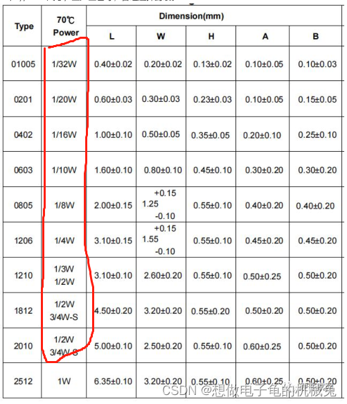
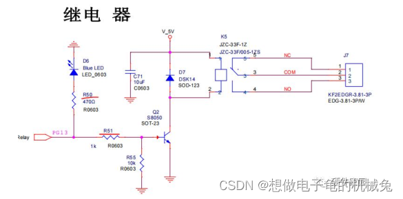
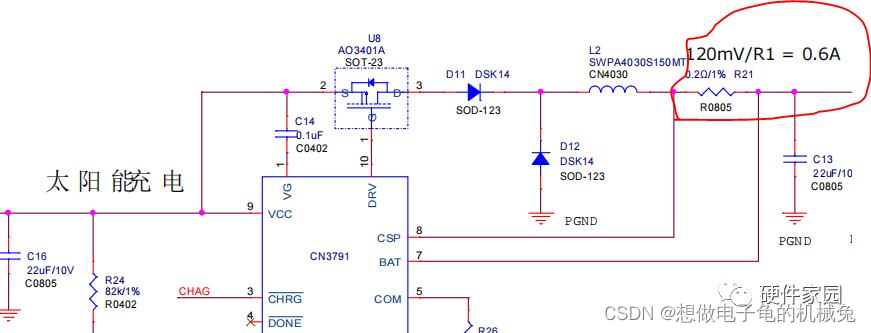
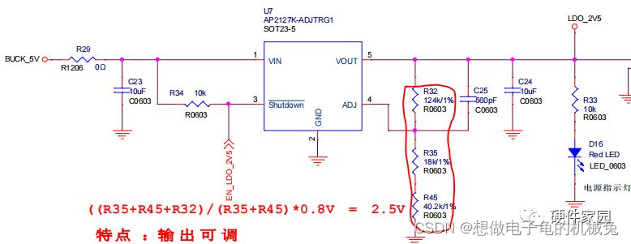
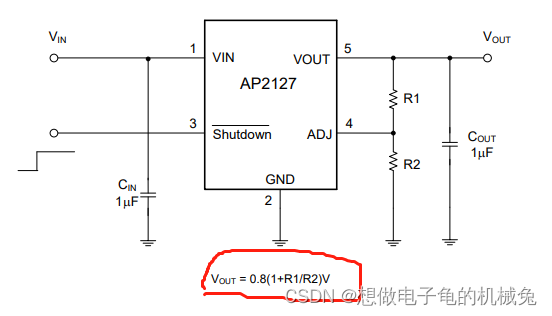
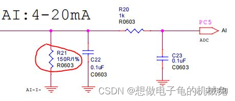
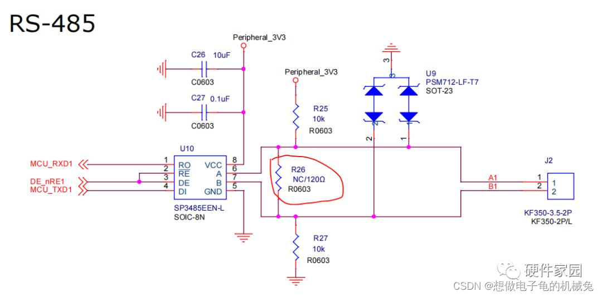
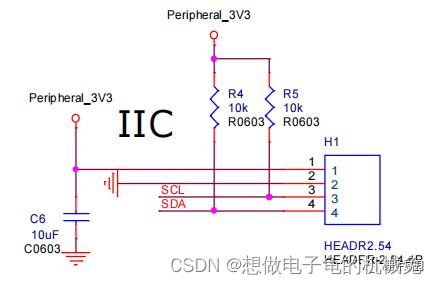
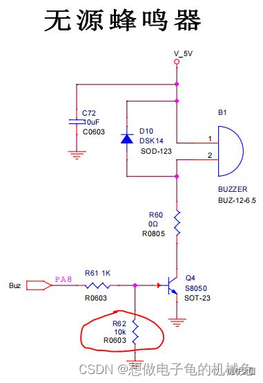
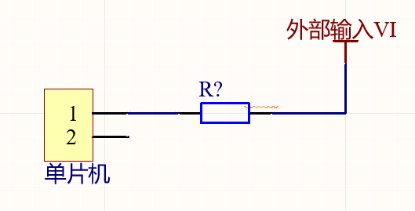

## 1. 电阻阻值的选择

1. 通过计算取值，比如反馈电路、分压电路以及限流电路、取样电路可计算取值。
2. 通过手册取值，使用部分IC的时候，IC手册中会有推荐电路取值，直接使用即可。
3. 通过经验取值，比如上拉电阻，一般为1K、4.7K、10K、100K等等。再比如485匹配电阻，一般为120Ω；

## 2. 功耗与封装

选定阻值后，就要确定电路中的电阻满足功耗，比如0603的一般功耗为0.1w，通过公式I2R计算功耗即可；

## 3. 精度相关的选型注意

一般情况下，尽量使用5%的精度即可满足大多数要求；

取样电路以及反馈电路要选取至少1%的精度；

## 4. 应用

### 4.1 限流

R50的作用为限流,取值原因：Blue LED灯的通电电压为2V，如想让蓝灯正常发光只需要几毫安即可，所以图中`(3.3-2)/470 = 2.7mA`，即可点亮LED；

R51的作用是限流三极管基极电流，三极管在这里的作用是处于饱和状态，饱和状态下，`Ib*β > Ic`，才可以保证三极管处于饱和状态，通过图中可知线圈的通电功率为450mW，450mW/5V = 90mA,所以只需`Ib*β> 90mA`即可，查阅手册可知，SS8050的β为120-400，取值120计算，只要120满足远远大于90mA,400就更满足，计算可得：3.3-0.7（三极管Ube之间的导通电压）/1000 = 2.6mA; 2.6*120 = 312mA,满足要求

### 4.2 恒流

IC芯片中的CSP和BAT的两引脚之间固定输出120mV，可将输出电流固定在120mV/0.2Ω=0.6A

### 4.3 分压

R32、R35、R45为分压电路，使得输出电压在2.5V

查阅芯片手册，如下图

### 4.4 取样

MCU只能采集电压，R21将电流4-20mA转化成0.6V-3V的电压

### 4.5 阻抗匹配

R26：R485的匹配电阻，满足长距离传输，可减少终端反射

- **USB：27R**
- **UART：1K**

### 4.6 上下拉电阻

上拉电阻：IIC总线要求总线默认高电平，需要上拉总线电压

下拉电阻：R62的作用是引脚PA8为悬浮功能的时候，确保Q4的基极引脚下拉为低电平，保证Q4不导通，下拉电阻越小，下拉能力越强

### 4.7 IO口限流

当外部模块输入电压高于单片机IO口电压时，串接电阻现在输入电流大小。

假定单片机IO口最大电压为3.6V，最大电流为5mA，则串接电阻计算：R > (VI-3.3)/5mA。

一般IO之间都串1K或者500Ω。