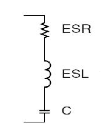
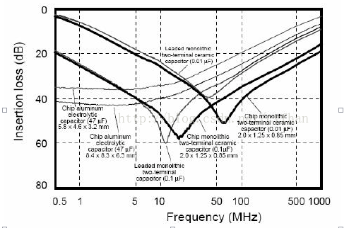

# 芯片IC附近放置的电容是多少？1uF、0.1uF、0.01uF如何选？

> **电容，电容的作用简单来说就是存储电荷。我们都知道在电源中要加电容滤波，在每个芯片的电源脚放置一个0.1uF的电容去耦。但是，有些板子芯片的电源脚旁边的电容是0.1uF的或者0.01uF的，有什么讲究吗？**

数字电路要运行稳定可靠，电源一定要“干净”，并且能量补充一定要及时，也就是滤波去耦一定要好。什么是滤波去耦，简单的说就是在芯片不需要电流的时候存储能量，在需要电流的时候又能及时地补充能量。

有读者看到这里会说，这个职责不是DC/DC、LDO的吗？对，在低频的时候它们可以搞定，但高速的数字系统就不一样了。

电容的作用简单来说就是存储电荷。我们都知道在电源中要加电容滤波，在每个芯片的电源脚放置一个0.1uF的电容去耦。但是，有些板子芯片的电源脚旁边的电容是0.1uF的或者0.01uF的，有什么讲究吗？

理想的电容它只是一个电荷的存储器，即C。而实际制造出来的电容却不是那么简单，分析电源完整性的时候我们常用的电容模型如下图所示。

上图中ESR是电容的串联等效电阻，ESL是电容的串联等效电感，C才是真正的理想电容。ESR和ESL是由电容的制造工艺和材料决定的，没法消除。那这两个东西对电路有什么影响。ESR影响电源的纹波，ESL影响电容的滤波频率特性。

我们知道：

电容的容抗

`Zc=1/ωC`

电感的感抗

`Zl=ωL，ω=2πf`

实际电容的复阻抗为：

`Z=ESR+j(ωL - 1/ωC)`

` =ESR+j2πf L-1/j2πf C`

可见，当频率很低的时候是电容起作用，而频率高到一定程度电感的作用就不可忽视了；再高的时候电感就起主导作用了，电容就失去滤波的作用了。所以，高频的时候电容就不是单纯的电容了。

实际电容的滤波曲线如下图所示：

上文说了，电容的等效串联电感是由电容的制造工艺和材料决定的。实际的贴片陶瓷电容，ESL从零点几nH到几个nH不等，封装越小ESL就越小。

从上图中看出，电容的滤波曲线并不是平坦的，它像一个’V’，也就是说有选频特性。有时候我们希望它越平越好（前级的板级滤波），而有时候希望它越尖越好（滤波或陷波）。

影响这个特性的是电容的品质因素Q：

Q=1/ωCESR

ESR越大，Q就越小，曲线就越平坦；反之ESR越小，Q就越大，曲线就越尖。

通常钽电容和铝电解有比较小的ESL，而ESR大，所以钽电容和铝电解具有很宽的有效频率范围，非常适合前级的板级滤波。也就是说，在DC/DC或者LDO的输入级，常常用较大容量的钽电容来滤波。而在靠近芯片的地方放一些10uF和0.1uF的电容来去耦，陶瓷电容有很低的ESR。

具体来说，当我们的芯片IC内部的逻辑门在10-50Mhz范围内执行的时候，芯片内部产生的干扰也在10-50Mhz,（比如51单片机），仔细看上图的曲线，0.1uF电容 （有两种，一种是插件，一种是贴片）的谷底刚好落在了这个范围内，所以能够滤除这个频段的干扰，但是，看清楚，是但是，当频率很高的时候（50-100Mhz），就不是那么回事了，这个时候0.1uF电容个滤波效果就没有0.01uF好了，以此类推，频率再高，选用的滤波电容的量级还要变小，具体怎么参考呢?

参考如下表：

所以，以后不要见到什么都放0.1uF的电容，有些高速系统中这些0.1uF的电容根本就起不了作用。

芯片或者说数字电路开关时候对电源影响大，引起电源波动，就要用电容来退偶。

容量一般为芯片开关频率的倒数，如果频率是1MHz的，就选用1/1M，也就是1uF的电容。可以取大点的。

**由于实际供电电源，夹杂着高频以及低频干扰杂波，10uf电容对于滤除低频杂波有较好作用，但对于高频杂波，电容呈现感性，阻抗很大，无法有效滤除，因此再并一个0.1uf的电容滤除高频杂波。**

对一个特定电容，当信号频率低于其自谐振频率时呈容性，当信号频率高于其自谐振频率时呈感性。当用0.1uF和0.01uF的两个电容并联时，相当于**拓宽了滤波频率范围**。

**两种方式组合滤波**

实际电路中我们需要去耦的频率范围会比较宽，因此一个电容搞不定，那怎么办呢？我们经常有两种方法来解决，**一种是使用一个大电容和一个小电容并联**，**还有一种是使用多个相同的电容并联**。

**1. 相同容值电容的并联：**

多个相同的电容并联后，阻抗曲线的整体形状不变，仍保持为一个大"V"型，但是各个频率点的阻抗整体下移减小。

**2. 不同容值电容的并联：**

当并联的电容容值不同时，由于每个电容的自谐振频率点不同，不同频段内，两个电容的行为特征存在差异。