# 运算放大器常用电路

## 1. 反相放大电路

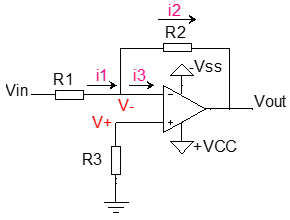
$$
V_{out} = - \frac{R2}{R1} * V_{in}
$$
关于R1,R2及R3的选值：

1）、R1,R2及R3应该在K级，不宜达到M级；

2）、R3应该等于或近似于R1与R2的并联，以消除偏置电流的影响。

## 2. 同相放大电路

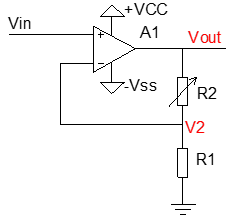
$$
V_{out} = (1 + \frac{R2}{R1}) * V_{in}
$$
同相放大电路的应用场合具有局限性，一般只用于直流电平的放大，不适合用于交流信号的放大，因为它会将交流信号的直流偏置电压一并放大，从而使其偏置电位发生偏移。带参考电平的反相比例放大电路在信号放大时比较有实用性。

## 3. 差分放大电路

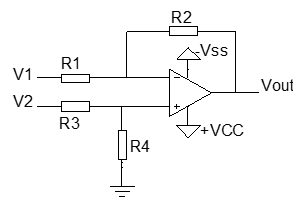
$$
V_{out} = (\frac{R1+R2}{R3+R4}) * \frac{R4}{R1} * V_2 -  \frac{R2}{R1} *V_1
$$
当R1=R3并且R2=R4时：
$$
V_{out} = \frac{R2}{R1} * (V_2 - V_2)
$$

## 4. 电压跟随电路

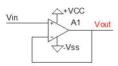
$$
V_{out} = V_{in}
$$
电压跟随电路一般用于信号的隔离。

### 可靠的参考电压电路

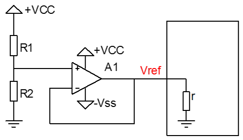

### 仪器放大电路

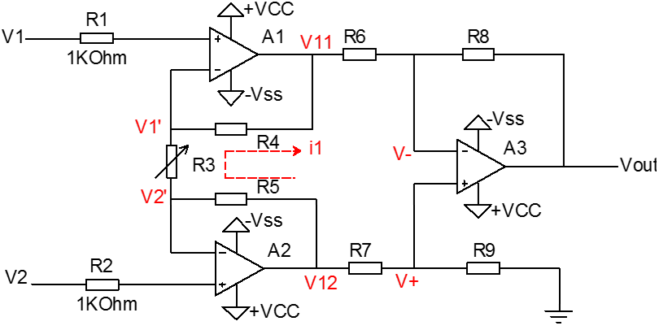

此方法电路使用于小信号的放大，一般用于传感器信号的放大。传感器的输出信号很小，一般只有几毫伏到几十毫伏。

电路由两级放大电路组成，第一级由A1,A2组成，同相输入，输入阻抗高，电路结构对称，可很好的抑制零点漂移；第二级由A3组成，良好的共模抑制比，输入阻抗高，增益在大范围内可调。

选值要求：R4=R5,R6=R7,R8=R9（保持电路的对称性），R3为可调电阻，用于调节电路增益。
$$
V_{out} = (1 + \frac{2 * R_4}{R_3}) * \frac{R_8}{R_6} * (V_2 - V_1)
$$

## 5. 反相求和电路

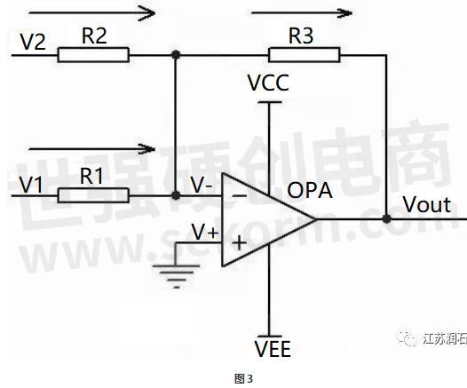
$$
V_{out} = -(V_1 + V_2)
$$

## 6. 同相求和电路

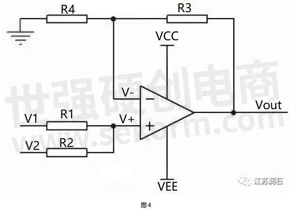
$$
V_{out} = (V_1 + V_2)
$$

## 7. 简单的比较器

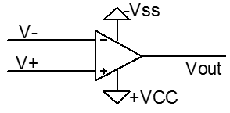
$$
V_{out} = (V_+ - V_-) * A_v
$$
Av为运放的开环放大倍数（一般为100dB左右，即十万倍）。当V+大于V-时，输出为正饱和（接近VCC，但是无法达到）；当V-大于V+时，输出为负饱和（接近-VSS，但是无法达到）。连接V+至地，构成过零比较器。

## 8. 过零比较器

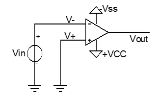

过零比较器虽然简单，但是并不实用，它的问题在于比较器只有一个临界电压，输入信号上的杂波易引起输出误操作，如图所示。

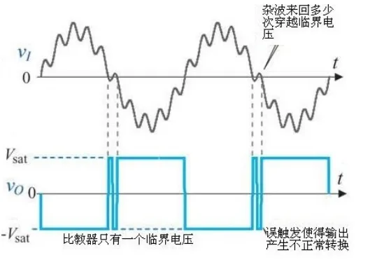

## 9. 迟滞比较器

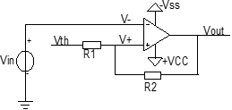

## 10. 窗口比较器

窗口比较的工作原理如图2.15所示。
1）Uin>URH>URL，A1输出UOH,A2输出UOL，D1导通，D2截止，Uout=UOH;
2）Uin<URL<URH，A1输出UOL,A2输出UOH，D1截止，D2导通，Uout=UOH;
3）URL< Uin<URH，A1输出UOL,A2输出UOL，D1截止，D2截止，Uout=UOL;

## 11. 积分器电路

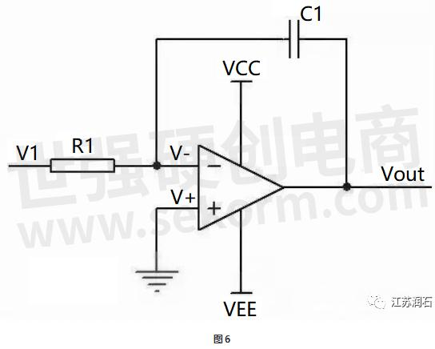

积分器电路的输入与输出的关系式为：

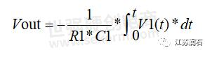

输出电压与输入电压对时间的积分成正比,这就是积分器电路了。若V1为恒定电压U，则上式变换为Vout=-U*t/(R1*C1)t是时间，则Vout输出电压是一条从0至负电源电压，按时间变化的直线。

## 12. 微分器电路

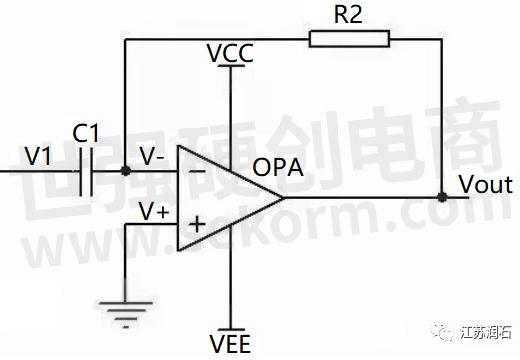

微分器输入输出关系式为：

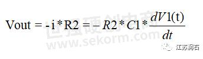

如果V1是一个突然加入的直流电压，则输出Vout对应一个方向与V1相反的脉冲。