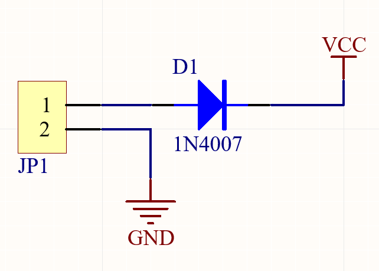
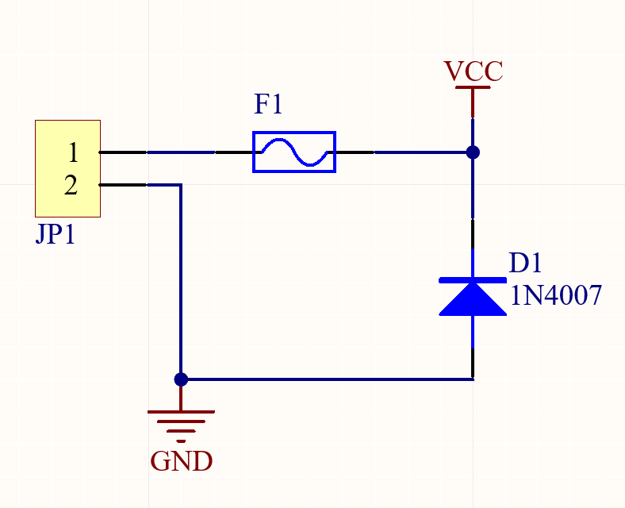
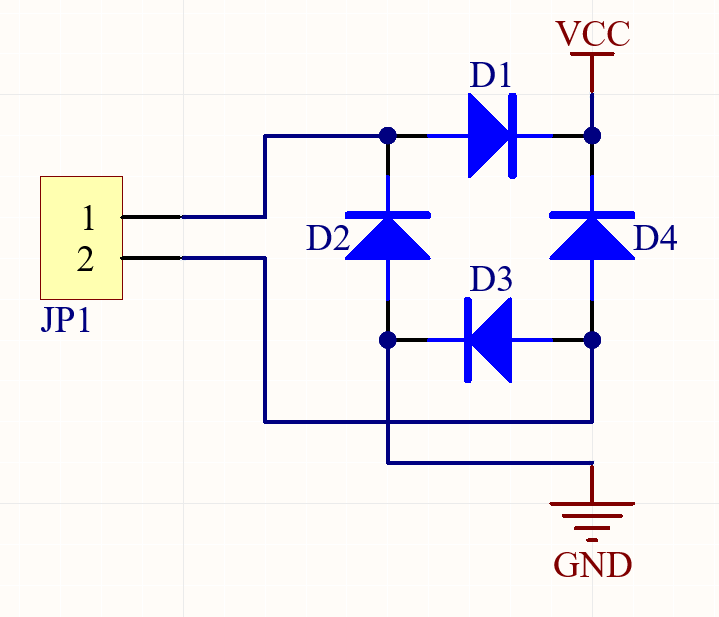
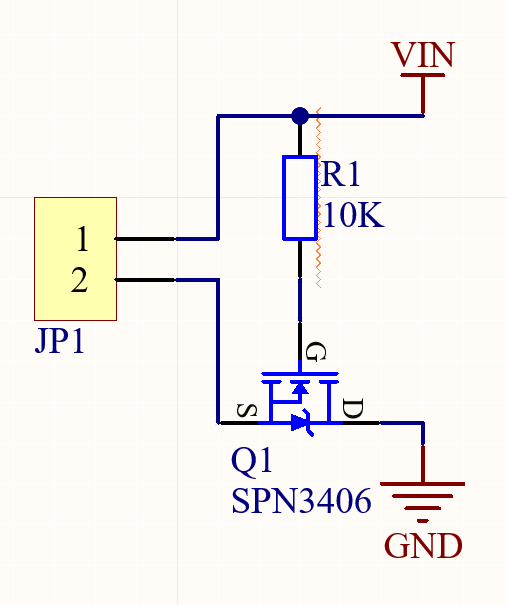
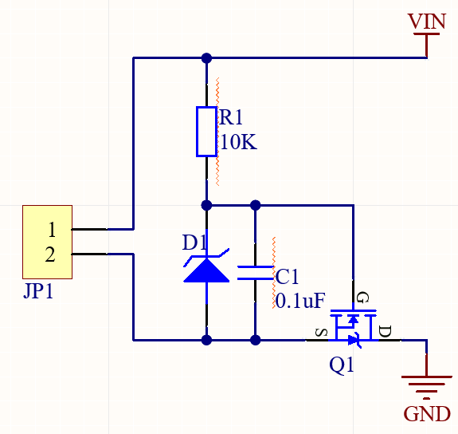
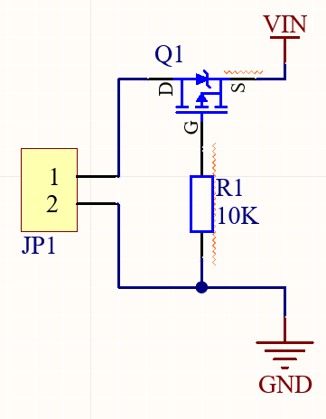

电源反接，会给电路造成损坏，电源反接是不可避免的。所以我们就需要给电路中加入保护电路，达到即使接反电源，也不会损坏的目的，下面介绍几种常用防反接电路。

## 1. 单二极管防反接电路

二极管防反接保护

通常情况下直流电源输入防反接保护电路是运用二极管的单向导电性来完结防反接保护。这种接法简略可靠，**但当输入大电流的情况下功耗影响是非常大的**。以输入电流额定值达2A,二极管额定管压降为0.7V，那么功耗至少也要达到：Pd＝2A×0.7V＝1.4W，这样功率低，**发热量大，要加散热器，不适合大电流供电电路、电池供电电路和低功耗电路**。

## 2. 二极管和自恢复保险防反接电路

利用自恢复保险和二极管防反接保护

利用自恢复保险和二极管防反接保护，**当电源接反造成短路，自恢复保险达到跳闸电流而断开**，也可以保护后级电路短路保护，此电路也会有损耗在自恢复保险上，在设计时要根据电压电流大小选择自恢复保险。

## 3. 全桥防反接电路

整流桥防反接保护

这个电路**适合交流和直流供电**产品，可以**直接接变压器或者开关电源，不用区分正负极**。缺点是**输入电流不能太大，太大会造成功率损耗**，是单个二极管的一倍损耗。

## 4. NMOS防反接电路

NMOS管防反接保护

运用了MOS管的开关特性，控制电路的导通和断开来规划防反接保护电路，由于功率MOS管的内阻很小，现在 MOSFET Rds现已可以做到毫欧级，对比现有选用二极管电源防反接方案存在的压降和功耗过大的问题。

极性反接保护将保护用场效应管与被保护电路串联联接。保护用场效应管为PMOS场效应管或NMOS场效应管。若为PMOS，其栅极和源极分别联接被保护电路的接地端和电源端，其漏极联接被保护电路中PMOS元件的衬底。若是NMOS，其栅极和源极分别联接被保护电路的电源端和接地端，其漏极联接被保护电路中NMOS元件的衬底。**一旦被保护电路的电源极性反接，保护用场效应管会构成断路，防止电流焚毁电路中的场效应管元件，保护整体电路**。

N沟道MOS管经过S管脚和D管脚串接于电源和负载之间，电阻R1为MOS管供应电压偏置，运用MOS管的开关特性控制电路的导通和断开，然后防止电源反接给负载带来损坏。正接时，R1供应VGS电压，MOS导通。反接的时MOS不能导通，所以起到防反接作用。功率MOS管的Rds根据不同管子，实践损耗很小，以20毫欧计算，2A的电流，功耗为（2×2)×0.02=0.08W根柢不必外加散热片。对比现有选用二极管电源防反接方案存在的压降和功耗过大的问题。

## 5. NMOS防反接电路

当输入电源大于MOS管VGS最大电压，应增加D7稳压管防止电源电压过高击穿mos管。当电源正确接入时。电流的流向是从Vin到负载，在通过NMOS到GND。刚上电时因为NMOS管的体二极管存在，地回路通过体二极管接通，后续因为Vgs大于VGS门限电压，MOS管导通。

当电源接反时，体二极管不通，并且Vgs的电压也不会符合要求，所有NMOS管不通，电路中没有电流回路，断路，负载不工作，也不会烧坏，实现了保护。

电路需要注意，正常情况下Vgs不能大于NMOS管的Vgs最大耐压值，如果超过了可以在Vgs上面跨接一个稳压管防止烧坏。

## 6. PMOS防反接电路

PMOS防反接保护

当没反接时，通过PMOS管的体二极管到达S极，G极低电平PMOS管导通，体二极管被短接，电流都从DS流过，MOS管导通后DS间的内阻很小，产生的压降基本可忽略。

当反接时，G极是高电平，PMOS管不会导通，起到保护电路的作用。

**NMOS管接在电源的负极，栅极高电平导通。**

**PMOS管接在电源的正极，栅极低电平导通。**

**NMOS管的导通电阻比PMOS的小，最好选NMOS。**