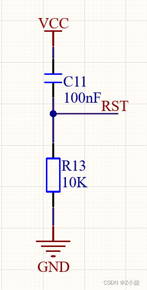
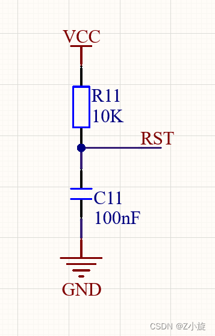
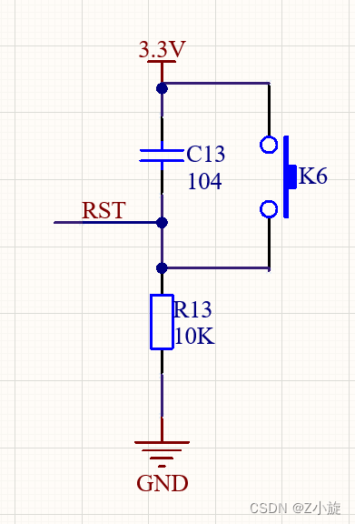
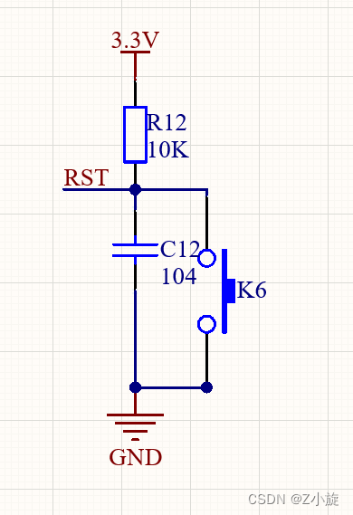

**什么是复位**
单片机复位电路的作用是：使单片机恢复到起始状态，让单片机的程序从头开始执行，运行时钟处于稳定状态、各种寄存器、端口处于初始化状态等等。目的是让单片机能够稳定、正确的从头开始执行程序。

**为什么要加复位？**
数字电路中寄存器和 RAM 在上电之后默认的状态和数据是不确定的，如果有复位，我们可以把寄存器复位到初始状态，RAM 的数据可以通过复位来触发 RAM 初始化
程序逻辑如果进入了错误的状态，通过复位可以把所有的逻辑状态恢复到初始值，如果没有复位，那么逻辑可能永远运行在错误的状态。(一些简单的IC芯片没有看门狗电路，就需要外部复位)

**正常单片机和IC芯片复位都是有一个Reset引脚，给复位引脚通一定时间的高/低电平就可以实现复位**

**典型的51单片机当RST复位脚持续两个机器周期以上高电平就将复位**

**像我们常用的STM32F1系列 ，查阅手册得知复位引脚需要持续20us以上的低电平，就可完成复位**

### 1. 高电平上电复位




**我们来看一下高电平上电复位，本质就是RC串联充电电路，在上电的瞬间，由于电容两端电压不能突变，上电后的一瞬间电容等效为短路，电容C11充电，充电电流在电阻上形成的电压为高电平；单片机复位，几个毫秒之后，电容充电完毕，电路为断路，电流为0，电阻两端电压近似于0V，这时RST就为低电平。单片机将进入正常工作状态。**

电容充电时间T/复位持续时间：

```c
T =（1/9）*R*C
```

### 2. 低电平上电复位



**低电平上电复位，由于电容两端电压不能突变的特性，在上电的瞬间RST端电位近似为GND，通过 10K电阻对 C11电容进行充电，此时RST复位引脚电压为低电平；单片机复位，几个毫秒之后，电容器充满，下面为断路，电流为0，电流经过电阻流入RST复位引脚， 引脚为高电平， 这时，单片机将进入正常工作状态。**

电容充电时间T/复位持续时间：

```c
T = 9*R*C
```

### 3. 高电平按键复位



高电平按键复位，VCC上电时，电容C充电，此时电路导通，在10K电阻上出现电压，[RST](https://so.csdn.net/so/search?q=RST&spm=1001.2101.3001.7020)引脚为高电平，使得单片机复位;几个毫秒后，C充满，此时电路为断路，10K电阻上电流降为0，电压也为0，RST引脚为低电平，使得单片机进入工作状态。工作期间，按下按键Key，电容两端相当于短路，电容C放电，RST引脚为高电平，使得单片机复位。松开按键Key，电容C又充电，几个毫秒后，充电完成，电路断路，单片机进入工作状态。

### 4. 低电平按键复位


低电平按键复位，VCC上电时，电容C充电，此时电路导通，RST引脚为低电平，使得单片机复位;几个毫秒后，电容C充满，此时电路为断路，电流由10K电阻流入RST复位引脚，RST引脚为高电平，使得单片机进入工作状态。工作期间，按下按键Key，RST复位引脚直接跟GND导通，为低电平，电容C放电，使得单片机复位。松开按键Key，电容C又充电，几个毫秒后，充电完成，电路断路，单片机进入工作状态。